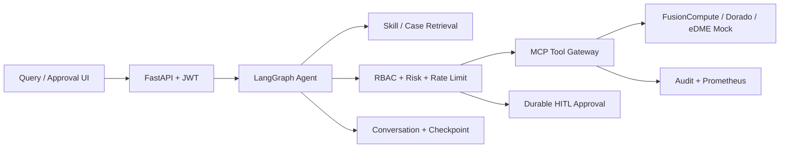

# ClawSphere DCS Copilot

面向华为 DCS/FusionCompute 的运维 Agent 参考实现，包含资源查询、告警解释、容量预测、VM 性能诊断、写操作护栏和人工审批。

## Architecture



Agent 主链路（四阶段渐进式工具/技能加载 + 有界 observation loop，详见 [docs/four-stage-agent-design.md](docs/four-stage-agent-design.md)）：
`context -> history_retriever -> skill_router(LLM1) -> skill_loader -> tool_search_planner(LLM2) -> tool_catalog_search -> tool_call_planner(LLM3) -> guardrail -> HITL/executor -> observe -> [tool_search_planner ...] -> llm_responder(LLM4) -> memory`。
`direct_answer`/`clarification_required`/无候选工具三处短路可以跳过后续规划阶段直接进入 Responder。

架构原则：**认知判断全部交给大模型，安全裁决全部由代码强制。**

- 三段式规划：Skill 选择、工具检索、工具调用各自是一次窄范围的 LLM 调用，每个阶段只看到当前决策所需的最小上下文（Skill 目录仅一句话摘要、候选工具仅 BM25 检索命中的少量完整 schema），而不是像早期版本那样一次性把全部工具 Schema 摊给模型；工具执行结果会作为明确标记的不可信 observation 回到规划阶段，模型可继续检索/调用或停止。
- 结构化校验：回答用 JSON schema 约束，模型自申报其引用的每个资源 ID（举例 vs 状态断言）；代码确定性核对——状态断言必须有本轮工具数据支撑，凭空捏造的资源被拒。
- 安全护栏（代码写死、大模型无法绕过）：写操作必须经 RBAC + HITL 审批且匹配已批准的工具与参数；Agent loop 同时受 3 轮工具执行、8 次累计工具调用和 8 次累计 LLM 调用硬上限约束；按用户/租户限流。写工具不能从 FastAPI 或 MCP 通道绕过 HITL，获批写操作执行后也不会自动串联下一次变更。
- 本系统的意图理解与回答生成依赖大模型：未配置 `DEEPSEEK_API_KEY` 或无法连接时，系统明确提示需要对接大模型，不提供确定性兜底回答。
- 对话、审批、审计和限流记录按用户/租户持久化。

当前启动脚本运行单个后端进程；进程内会话锁和聊天限流适用于本机 Demo。生产环境若启用多
worker 或多实例，应在 API Gateway/Redis/PostgreSQL 层实现共享限流、并发租约和会话锁，
不能把本 Demo 的进程内保护当作分布式保证。

## Install

基础 SQLite Demo：

```bash
python -m venv .venv
# Windows: .venv\Scripts\activate
# Linux/macOS: source .venv/bin/activate
pip install -r requirements-base.txt -r requirements-dev.txt
```

PostgreSQL/pgvector 和 Langfuse 支持为可选依赖：

```bash
pip install -r requirements-postgres.txt
pip install -r requirements-observability.txt
```

`requirements.txt` 会安装全部功能和开发依赖。

## Configuration

真实平台统一配置位于 `config/platforms.json`，支持 IP + 账号密码或 IP + Session。详细说明见 `docs/real-platform-config.md`。

复制 `.env.example` 为 `.env` 并按环境填写。

- `DEMO_MODE=true`：开放匿名 readonly 和 demo-token，仅用于本机演示。
- `DEMO_MODE=false`：禁用匿名访问与 demo-token，且强制要求至少 32 字符的 `DCS_JWT_SECRET`。
- `DEEPSEEK_API_KEY`：启用 LLM intent、structured planner、摘要和回答生成。
- `DEEPSEEK_MODEL`：当前端点支持 `deepseek-v4-pro` 和 `deepseek-v4-flash`，默认使用 `deepseek-v4-pro`。
- `DEEPSEEK_API_URL`：仅接受标准 HTTPS `api.deepseek.com` Chat Completions 地址，避免把凭据发送到错误主机。
- `DCS_LLM_SEMANTIC_COMPRESSION`：默认 `true`；请求 body 超过 90 KiB 时启用本机语义压缩。
- `DCS_LLM_COMPRESSOR_URL`：本机 Ollama Chat API，仅允许 loopback `/api/chat` 地址。
- `DCS_LLM_COMPRESSOR_MODEL`：默认 `qwen3.5:4b-q4_K_M`；首次使用前运行 `ollama pull qwen3.5:4b-q4_K_M`。
- `DCS_MEMORY_BACKEND=postgres`：Skill 存储切换到 PostgreSQL/pgvector。
- `DCS_CHECKPOINT_BACKEND=postgres`：LangGraph checkpoint 切换到 PostgresSaver。
- `DCS_CORS_ORIGINS`：逗号分隔的前端允许来源；生产环境应设置为实际部署域名。
- `DCS_CHAT_RATE_PER_MINUTE` / `DCS_CHAT_BURST_PER_10S`：单用户聊天速率与突发请求上限。
- `DCS_CHAT_MAX_CONCURRENT_PER_USER` / `DCS_CHAT_MAX_CONCURRENT_GLOBAL`：单用户与进程级聊天并发上限。
- `MCP_AUTH_TOKEN`：生产 MCP Server 的调用身份；Demo 可使用 `MCP_CALLER_*` 环境变量。

生产环境应由外部 IdP 签发身份令牌，并将 `DEMO_MODE` 设为 `false`。

Agent 的固定产品身份为“ClawSphere DCS 运维智能体（DCS Copilot）”。聊天响应包含脱敏的
`response_source`、`llm_status` 和 `context`，前端会明确显示 DeepSeek 正常、降级或未配置状态。
对话历史使用 3000 token 预算，组合旧对话摘要、相关历史、最近消息和结构化工作状态；所有 LLM
出站 payload 会先执行敏感字段脱敏，再由本地请求预算门精确序列化为 UTF-8 JSON：不超过
90 KiB（92,160 字节）直接发送，超限时仅压缩历史消息并以 80 KiB 为目标重新复检；固定
system/developer 指令、当前用户请求和工具 schema 不参与压缩。压缩器不可用或最终 body
仍超限时失败关闭，绝不会向外部模型发送超过 90 KiB 的请求。身份与安全规则
始终位于固定系统提示词中，不参与对话压缩。同一会话存在待审批写操作时，新消息会返回
HTTP 409，必须先完成审批，以防止历史记录和摘要发生乱序。

## Run

后端：

```bash
python -m uvicorn backend.app:app --host 127.0.0.1 --port 8010
```

前端：

```bash
cd frontend
pnpm install
pnpm dev --host 127.0.0.1 --port 5174
```

Windows 也可以在仓库根目录运行 `./start-demo.ps1`。

- 查询工作台：http://127.0.0.1:5174/
- 管理员审批台：http://127.0.0.1:5174/approval
- OpenAPI：http://127.0.0.1:8010/docs
- Prometheus：http://127.0.0.1:8010/metrics/

启动 pgvector：

```bash
docker compose up -d postgres
```

## MCP Server

使用官方 MCP Python SDK，默认 stdio：

```bash
python -m backend.mcp.mcp_server
```

设置 `MCP_TRANSPORT=streamable-http` 可切换到 Streamable HTTP。每次 MCP 调用都会写入 caller、tenant、task 和 audit_id。

MCP/API 外部写操作采用一次性审批票据：

1. 调用 `create_approval_request`，传入调用方生成的 `task_id` 和完整 `tool_calls`（工具名及参数）。
2. 独立审批人在 `/api/approvals/{id}/decision` 批准该任务。
3. 调用 `restart_vm`、`scale_cluster` 或 `modify_ha_policy` 时携带同一个 `task_id` 和完全一致的参数。

执行成功后审批状态变为 `executed`，同一票据不能重复执行，也不能用于其他工具或参数。

## API

| Endpoint | Purpose |
|---|---|
| `POST /api/chat` | Agent 对话，同一 conversation 受 user/tenant 归属保护 |
| `POST /api/tools/call` | JWT 工具网关 |
| `GET /api/approvals` | 当前租户审批列表 |
| `POST /api/approvals/{id}/decision` | maker-checker 审批与断点恢复 |
| `GET /api/audit` | 当前租户工具审计 |
| `GET /api/memory` | 当前租户 Agent memory 写入摘要 |
| `GET /metrics/` | Prometheus 指标 |

## Retrieval

Skill 采用一句话、摘要、详细步骤三层加载。默认检索模式为 BM25，适合告警码、资源 ID 和指标名等运维专有字符串。数据库保留 pgvector 字段供接入真实 embedding；未配置语义模型时不使用哈希伪向量参与排序。

## Quality

```bash
python -m pytest -q
python -m eval.evaluator
```

评测覆盖 intent、tool、fact、safety 四个维度，整体门禁为 90%，安全维度必须达到 100%。`eval/report.json` 是运行时产物，不提交到仓库。
