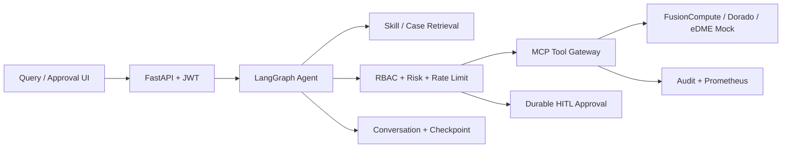

# ClawSphere DCS Copilot

面向华为 DCS/FusionCompute 的运维 Agent 参考实现，包含资源查询、告警解释、容量预测、VM 性能诊断、写操作护栏和人工审批。

## Architecture



Agent 主链路：`intent -> context -> retrieval -> planner -> guardrail -> HITL/executor -> response -> memory`。

- 配置 DeepSeek Key 时，Planner 使用 structured tool-calling 输出工具计划。
- 无 Key 时使用确定性规则作为离线兜底；两种计划都经过相同的 Schema、RBAC、资源和风险校验。
- 写工具必须关联已批准的审批任务，不能从 FastAPI 或 MCP 通道绕过 HITL。
- 对话、审批、审计和限流记录按用户/租户持久化。

## Install

基础 SQLite Demo：

```bash
python -m venv .venv
# Windows: .venv\Scripts\activate
# Linux/macOS: source .venv/bin/activate
pip install -r requirements-base.txt -r requirements-dev.txt
```

PostgreSQL/pgvector 和 Langfuse 支持为可选依赖：

```bash
pip install -r requirements-postgres.txt
pip install -r requirements-observability.txt
```

`requirements.txt` 会安装全部功能和开发依赖。

## Configuration

真实平台统一配置位于 `config/platforms.json`，支持 IP + 账号密码或 IP + Session。详细说明见 `docs/real-platform-config.md`。

复制 `.env.example` 为 `.env` 并按环境填写。

- `DEMO_MODE=true`：开放匿名 readonly 和 demo-token，仅用于本机演示。
- `DEMO_MODE=false`：禁用匿名访问与 demo-token，且强制要求至少 32 字符的 `DCS_JWT_SECRET`。
- `DEEPSEEK_API_KEY`：启用 LLM intent、structured planner、摘要和回答生成。
- `DCS_MEMORY_BACKEND=postgres`：Skill 存储切换到 PostgreSQL/pgvector。
- `DCS_CHECKPOINT_BACKEND=postgres`：LangGraph checkpoint 切换到 PostgresSaver。
- `DCS_CORS_ORIGINS`：逗号分隔的前端允许来源；生产环境应设置为实际部署域名。
- `MCP_AUTH_TOKEN`：生产 MCP Server 的调用身份；Demo 可使用 `MCP_CALLER_*` 环境变量。

生产环境应由外部 IdP 签发身份令牌，并将 `DEMO_MODE` 设为 `false`。

## Run

后端：

```bash
python -m uvicorn backend.app:app --host 127.0.0.1 --port 8010
```

前端：

```bash
cd frontend
pnpm install
pnpm dev --host 127.0.0.1 --port 5174
```

Windows 也可以在仓库根目录运行 `./start-demo.ps1`。

- 查询工作台：http://127.0.0.1:5174/
- 管理员审批台：http://127.0.0.1:5174/approval
- OpenAPI：http://127.0.0.1:8010/docs
- Prometheus：http://127.0.0.1:8010/metrics/

启动 pgvector：

```bash
docker compose up -d postgres
```

## MCP Server

使用官方 MCP Python SDK，默认 stdio：

```bash
python -m backend.mcp.mcp_server
```

设置 `MCP_TRANSPORT=streamable-http` 可切换到 Streamable HTTP。每次 MCP 调用都会写入 caller、tenant、task 和 audit_id。

MCP/API 外部写操作采用一次性审批票据：

1. 调用 `create_approval_request`，传入调用方生成的 `task_id` 和完整 `tool_calls`（工具名及参数）。
2. 独立审批人在 `/api/approvals/{id}/decision` 批准该任务。
3. 调用 `restart_vm`、`scale_cluster` 或 `modify_ha_policy` 时携带同一个 `task_id` 和完全一致的参数。

执行成功后审批状态变为 `executed`，同一票据不能重复执行，也不能用于其他工具或参数。

## API

| Endpoint | Purpose |
|---|---|
| `POST /api/chat` | Agent 对话，同一 conversation 受 user/tenant 归属保护 |
| `POST /api/tools/call` | JWT 工具网关 |
| `GET /api/approvals` | 当前租户审批列表 |
| `POST /api/approvals/{id}/decision` | maker-checker 审批与断点恢复 |
| `GET /api/audit` | 当前租户工具审计 |
| `GET /api/memory` | 当前租户 Agent memory 写入摘要 |
| `GET /metrics/` | Prometheus 指标 |

## Retrieval

Skill 采用一句话、摘要、详细步骤三层加载。默认检索模式为 BM25，适合告警码、资源 ID 和指标名等运维专有字符串。数据库保留 pgvector 字段供接入真实 embedding；未配置语义模型时不使用哈希伪向量参与排序。

## Quality

```bash
python -m pytest -q
python -m eval.evaluator
```

评测覆盖 intent、tool、fact、safety 四个维度，整体门禁为 90%，安全维度必须达到 100%。`eval/report.json` 是运行时产物，不提交到仓库。
