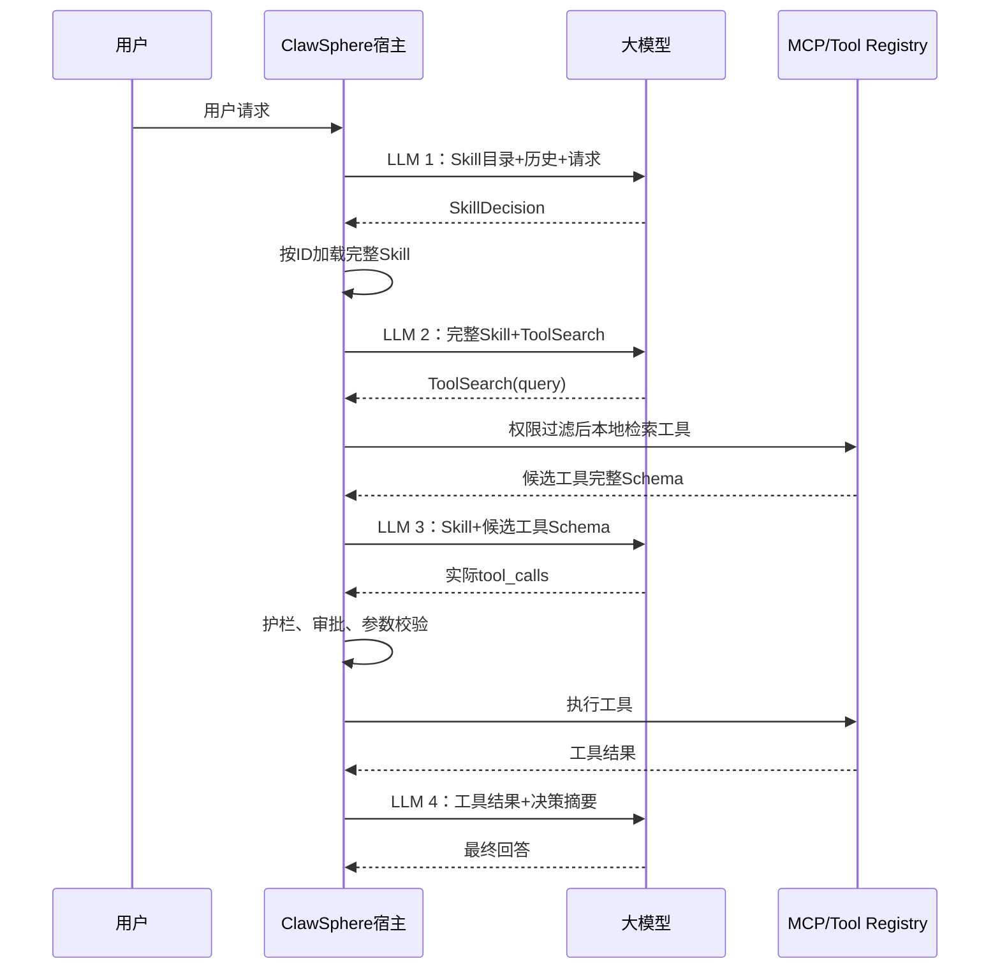

# ClawSphere Agent 四阶段 LLM 调用重排方案

> 承接 [architecture-issues-analysis.md](./architecture-issues-analysis.md) 提出的三个问题，给出落地方案：把当前一次 Router 拆成三次规划推理，再保留一次最终回答，形成标准工具任务的四次 LLM 调用。现有 Skill Loader、BM25、`TOOL_REGISTRY`、护栏、HITL 和工具执行器都可以复用，不需要引入向量库或新 Agent 框架。
>
> 本文是评审方案，未修改代码。

## 一、现状与需要修正的判断

当前实际链路是：

```text
context_loader
→ memory_retriever
→ llm_router（全量 RBAC 工具 Schema）
→ guardrail/HITL
→ tool_executor
→ llm_responder
```

确认的问题：

- Skill Tier-1 已进入 Router Prompt，但 BM25 检索的 Tier-2 只进入 Responder，没有参与工具规划（`copilot.py:178`）。
- Router 每次收到当前角色允许的全部工具 Schema（`copilot.py:186`）。
- `retrieved_history` 检索后没有进入 Router 或 Responder，只是原样透传到最终返回值。
- `retrieve_skill_detail()` 已存在，但当前流水线没有使用（`retriever.py:102`）。
- Agent 实际通过 `call_tool()` 直接调用本地注册表，并没有作为 MCP Client 调用 `tools/list`/`tools/call`（`copilot.py:290`）。
- `TOOL_REGISTRY` 有 18 个工具，而 MCP Server 手工暴露 16 个（缺 `list_clusters`、`get_vm_detail`），存在定义漂移（`mcp_server.py:36`）。

对 `architecture-issues-analysis.md` 的修正（已同步到原文）：

- "20 个工具" 已改为注册表 18 个、MCP Server 16 个。
- `ScaleClusterParams` 没有原报告所说的 `scaling_group_params`（`schemas.py:87`）。
- "在 Router 前使用 Router 输出做 `skill_align`" 时序不成立（Router 还没跑，不可能有其输出可用）。
- `_llm_history` 当前不包含 BM25 文档。
- 删除完整 Schema、只保留 `name+description` 后仍作为真实 function tool 传递并不稳妥；应该使用独立的 `ToolSearch` 元工具，而不是让模型对着一份"残缺"的工具列表做 function calling。

## 二、目标四轮链路



四轮分别承担单一职责：

1. Skill 选择。
2. 生成工具检索请求。
3. 生成真实工具调用。
4. 根据工具结果回答。

这四轮是"需要工具的标准路径"。寒暄、身份、纯概念问题应允许在第一轮返回 `direct_answer`，然后直接进入 Responder，避免强制走满四轮。

## 三、各阶段契约

### 1. LLM 1：Skill Router

输入：

- 稳定基础 System Prompt。
- 按角色过滤后的 Skill `id + description/one_liner`。
- 会话摘要和近期历史。
- 当前用户请求。
- 内部 `Skill` 元工具或结构化输出协议。

输出建议：

```json
{
  "decision": "use_skill",
  "skill_ids": ["diagnose_vm_performance"],
  "arguments": {
    "resource_hint": "vm-1001"
  },
  "confidence": 0.92,
  "missing_context": [],
  "reason_summary": "用户要求诊断指定VM性能"
}
```

其他合法决策：

```text
direct_answer
clarification_required
use_skill
```

这里不再根据用户原话直接 BM25 检索 Skill。模型选择是主路径，BM25 最多用于召回候选或降级，不能覆盖模型的明确 Skill 选择。

### 2. 宿主加载完整 Skill

按照 `skill_id` 精确加载 Tier-2/Tier-3，而不是再次使用文本相似度。

加载时检查：

- Skill 是否存在。
- 当前角色是否适用。
- Skill 版本。
- 是否允许当前租户使用。
- Skill 建议的工具类别和风险约束。

建议将当前 `retrieve_skill_detail()` 调整为支持标准化 Skill ID，而不是依赖把 `:tier2` 替换成 `:tier3`。

### 3. LLM 2：Tool Search Planner

输入：

- 已选完整 Skill。
- MCP Server instructions。
- 允许暴露的工具名称目录或分类摘要。
- `ToolSearch` 元工具。
- 当前任务上下文。

输出：

```json
{
  "query": "VM performance metrics detail related alarms",
  "top_k": 5,
  "required_capabilities": [
    "vm_detail",
    "performance_metrics"
  ]
}
```

这个查询来自模型对用户请求和完整 Skill 的综合理解，不再直接使用原始用户消息作为唯一检索词。

### 4. 宿主检索 MCP 工具

第一步必须先过滤：

```text
租户
→ 当前角色
→ 环境
→ 工具启用状态
→ 风险策略
```

然后在允许集合内检索。

短期可以继续使用现有 BM25，但索引对象改成工具元数据：

```text
tool_name
description
category
tags
server_instructions
related_skill_ids
```

检索结果返回 1～5 个候选工具的完整 Schema。BM25 只是候选召回器，最终工具和参数仍由第三轮模型决定。

### 5. LLM 3：Tool Call Planner

输入：

- 用户请求和必要历史。
- 已选完整 Skill。
- Tool Search 返回的少量完整 Schema。
- 缺失信息、资源标识和前两阶段的结构化摘要。

输出继续沿用当前格式：

```json
{
  "tool_calls": [
    {
      "tool_name": "get_vm_metrics",
      "params": {
        "vm_id": "vm-1001",
        "time_range": "1h"
      }
    }
  ],
  "reason_summary": "获取指定VM最近一小时性能指标"
}
```

之后继续复用现有：

```text
MAX_TOOL_CALLS_PER_TURN
→ Pydantic参数校验
→ RBAC复检
→ 风险判断
→ HITL
→ 执行前再次复检
```

### 6. LLM 4：Responder

输入应包含：

- 用户请求。
- `SkillDecision` 摘要。
- 已选 Skill ID 和版本。
- `ToolSearch` 决策摘要。
- 实际执行计划。
- 工具结果。
- 历史案例——如果确实要使用。
- 错误、审批或拒绝状态。

不必再次塞入完整工具 Schema；完整 Skill 正文也只在最终回答确实依赖其说明时保留。

## 四、LangGraph 调整方案

目标图建议调整为：

```text
context_loader
→ history_retriever
→ skill_router                 LLM 1
→ skill_loader                 宿主
→ tool_search_planner          LLM 2
→ tool_catalog_search          宿主
→ tool_call_planner            LLM 3
→ guardrail
→ HITL
→ tool_executor
→ llm_responder                LLM 4
→ memory_writer
```

增加三条短路：

```text
skill_router.direct_answer
→ llm_responder

skill_router.clarification_required
→ llm_responder

tool_catalog_search.no_candidate
→ llm_responder
```

不要让 Router、Skill Loader、Tool Search 和执行器相互隐式推断；每一步都通过结构化 State 字段交接。

## 五、状态模型建议

在现有 `CopilotState` 中增加或拆分：

```text
skill_decision
selected_skill_ids
loaded_skills
skill_catalog_version

tool_search_request
tool_search_candidates
selected_tool_schemas
tool_catalog_version

route_decisions
authorization_epoch

llm_stage_metrics
agent_step_count
```

现有字段处理：

- `retrieved_docs`：拆成 `loaded_skills` 和 `retrieved_cases`。
- `retrieved_history`：改名为 `retrieved_cases` 并真正接入 Responder；否则删除这次检索。
- `plan`：替换成结构化 `route_decisions`，避免只保存一句自由文本。
- `tool_calls_proposed`、`tool_results`、HITL 字段继续保留。

## 六、模块级改动范围

不展开到函数级补丁，评审阶段预计涉及：

- `backend/agent/copilot.py`：状态、图节点和阶段路由。
- `backend/agent/llm.py`：拆分三种规划调用，统一结构化解析和错误处理。
- `backend/skills/loader.py`：角色过滤、按 ID 加载、版本和目录快照。
- `backend/memory/retriever.py`：BM25 从"用户请求检索 Skill"调整为"模型查询检索工具"；历史案例单独保留。
- `backend/mcp/tools.py`：为工具增加分类、标签、关联 Skill、目录版本等检索元数据。
- `backend/mcp/mcp_server.py`：消除手工暴露工具和注册表漂移。
- 现有单元测试与安全回归测试。

不需要新增第三方依赖。

## 七、MCP 边界分两步实施

### 第一阶段：进程内渐进加载

以 `TOOL_REGISTRY` 为唯一目录源：

```text
ToolSearch
→ RBAC过滤TOOL_REGISTRY
→ BM25检索
→ 返回候选Schema
→ call_tool执行
```

优点是改造小，能先验证四轮时序和 Token 收益。

但评审文档必须明确：

> 这是"基于 MCP 工具定义的进程内渐进加载"，还不是真正通过 MCP Client 动态发现。

### 第二阶段：真正 MCP Client 化

后续再把目录来源替换为：

```text
MCP Client
→ tools/list
→ 本地目录索引
→ listChanged/TTL触发刷新
→ tools/call
```

同时让 `TOOL_REGISTRY` 驱动 MCP Server 注册，或者让 Agent 完全以 `tools/list` 为准，解决当前 18/16 漂移。

不建议在第一批改造中同时完成真正 MCP Client 化，否则会把"渐进加载验证"和"协议边界迁移"耦合在一起，扩大评审范围。

## 八、权限和目录变化

三个时间点都要检查权限：

```text
Skill目录生成前
ToolSearch检索前
真实工具执行前
```

会话保存 `authorization_epoch`。如果权限版本变化：

```text
清除已选候选工具Schema
→ 重新生成有效目录
→ 重新执行ToolSearch
→ 废弃旧工具计划
```

当前进程内版本使用：

```text
tool_catalog_version
skill_catalog_version
authorization_epoch
```

真正 MCP Client 化后，再接入 `tools/list`、`listChanged` 和 TTL 刷新。

## 九、Prompt 前缀缓存设计

四个阶段的工具集合不同，因此不要承诺"四轮之间共享同一个完整前缀缓存"。更现实的是建立四个稳定的阶段缓存池：

```text
Skill Router前缀
Tool Search Planner前缀
Tool Call Planner前缀
Responder前缀
```

每个阶段内部保持：

- System 基础身份和安全规则稳定。
- Skill/工具排列稳定。
- JSON 序列化键顺序稳定。
- 版本号稳定。
- 用户、时间戳、request ID 放在动态后缀。

Skill 和工具目录更新时，通过目录版本自然形成新前缀；旧 KV 缓存不再命中，等待服务端 TTL 淘汰。

## 十、其他小问题一并纳入

建议一起进入评审清单：

1. 修正架构分析报告中的工具数量、Schema 和时序错误（已在 `architecture-issues-analysis.md` 中标注）。
2. `retrieved_history` 要么真正使用，要么停止每轮无效检索。
3. 统一身份基础 Prompt，避免 Router 和 Responder 各自维护产品身份。
4. 不再在模块加载时固定生成永不变化的 Skill 目录；至少支持版本快照或受控刷新。
5. MCP 工具定义改为单一事实源，解决 18/16 漂移。
6. `_cap()` 当前会把大型结构化结果截成字符串，应改成按字段、数组条数和优先级压缩。
7. 每个 LLM 阶段设置独立超时、重试和降级策略。
8. "四轮"只是正常路径；Responder 当前最多重试三次，因此必须增加总 LLM 调用预算，避免异常时超过预期。
9. Tool Search 查询属于模型输出，必须限制长度、字符集、`top_k` 和允许搜索的目录范围。
10. 写工具即使被搜索出来，也不能绕过现有 RBAC、HITL 和执行前复检。

## 十一、验收标准

### 功能验收

- 用户问题只使模型看到 Skill 描述，不看到全部 Skill 正文。
- LLM 1 选择哪个 Skill，宿主就精确加载哪个 Skill。
- LLM 1、LLM 2 不包含全部 MCP Schema。
- LLM 3 只包含 Tool Search 命中的少量 Schema。
- 标准工具路径能观察到四次 LLM 调用。
- 概念或澄清路径可以短路。
- Skill 选择不再依赖用户原话 BM25 命中。

### 安全验收

- 未授权 Skill 不进入 Skill 目录。
- 未授权工具既不能被 Tool Search 返回，也不能执行。
- 权限在会话中变化后，旧候选和旧计划失效。
- 写操作仍然经过参数校验、审批和执行前复检。

### 稳定性验收

- Skill 不存在、工具搜索无结果、Schema 变化、LLM 超时都有明确降级。
- 总 LLM 调用和工具调用都有硬预算。
- LangGraph checkpoint 恢复后不会重复执行写操作。
- 大结果压缩后仍保留资源 ID、状态、时间和关键指标。

### 可观测性验收

每轮至少记录：

```text
stage
selected_skill_ids
tool_search_query
candidate_tool_names
actual_tool_names
prompt_tokens
completion_tokens
cache_hit_tokens
latency
authorization_epoch
catalog_version
fallback_reason
```

并比较改造前后的：

```text
端到端P50/P95延迟
总输入Token
缓存命中率
Skill选择准确率
Tool Top-K召回率
工具误调用率
任务成功率
```

## 十二、方案比较与推荐

| 方案 | 评价 |
|---|---|
| 继续现状，只修复 `retrieved_docs` | 成本最低，但没有实现 Skill/MCP 双渐进加载 |
| 复用现有组件，重排为四阶段 | 推荐；能满足评审目标，安全骨架基本不动 |
| 一次完成原生 MCP Client、动态通知、向量检索 | 最完整，但范围和风险明显过大，不适合作为第一批 |

推荐按三批实施：

1. 先修正文档和定义阶段契约。
2. 实现进程内四阶段渐进加载及测试。
3. 单独评审真正 MCP Client 化和动态目录同步。

整体预计是中等规模、多文件改造。主要风险不是代码量，而是四轮延迟、阶段状态恢复、权限变化和 Prompt 回归。正式实施前应先批准第二批范围；第三批不要默认包含在第一轮实现中。
