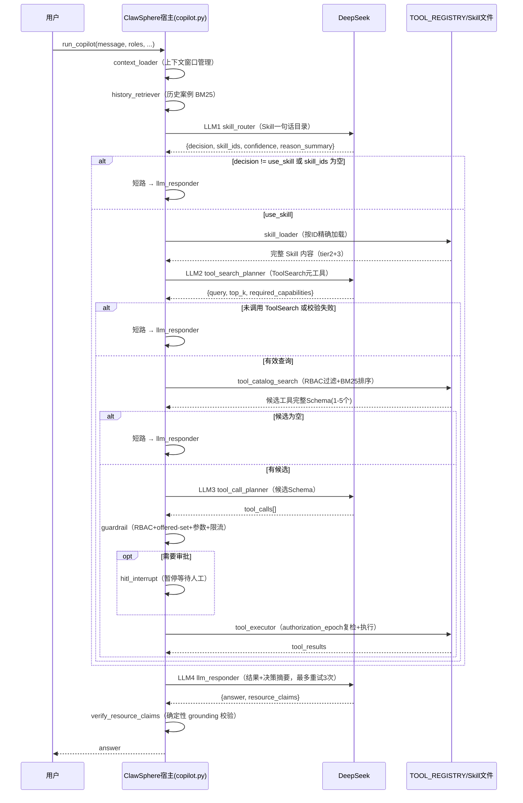

# ClawSphere 四阶段 Agent —— 设计文档（As-Built）

> 本文档描述**已实现**的系统，是 [four-stage-agent-architecture-proposal.md](./four-stage-agent-architecture-proposal.md)（评审方案）和 [four-stage-implementation-plan.md](./four-stage-implementation-plan.md)（分步实施计划）落地后的最终状态。三份文档的关系：**提案回答"为什么这么改"，实施计划回答"分几步改"，本文档回答"现在系统长什么样、边界在哪里"**。
>
> 配套完成了一轮设计/约束核对（见第七节），修复了核对中发现的 3 个问题，其余差异已在第八节列为已知限制。全部 96 个测试通过，且在任意文件执行顺序下稳定（含逆序、单文件、全量四种组合的交叉验证）。

## 一、系统边界

进程内四阶段渐进加载（提案里的"第二批"）。`TOOL_REGISTRY` 是唯一的工具目录源；Skill 目录来自 `backend/skills/*.md` 文件。**不包含**真正的 MCP Client 化（`tools/list`/`tools/call` 协议、`listChanged` 通知）——Agent 仍然直接调用 `backend.mcp.tools.call_tool()`，`backend/mcp/mcp_server.py` 是给外部 MCP Client 用的独立入口，与 Agent 主链路无关。这条边界在提案里是刻意的（第七节），不是遗漏。

## 二、总体架构



标准工具路径（用户消息需要真实数据）观察到 **3 次规划 LLM 调用 + 1 次回答 LLM 调用 = 4 次**。寒暄/身份/概念问题在 LLM1 后直接短路，只有 1 次规划调用 + 1 次回答调用。这是设计上的差异化路径，不是退化。

## 三、图节点一览

| 节点 | 文件位置 | 类型 | 职责 |
|---|---|---|---|
| `context_loader` | `copilot.py:305` | 宿主 | 上下文窗口管理（六轮滚动摘要），不变 |
| `history_retriever` | `copilot.py:334` | 宿主 | 仅检索历史案例（`retrieve_history`），不再检索 Skill |
| `skill_router` | `copilot.py:403` | **LLM1** | 角色过滤后的 Skill 一句话目录 → `{decision, skill_ids, ...}` |
| `skill_loader` | `copilot.py:347` | 宿主 | 按 `skill_id` 精确加载完整内容，二次角色校验 |
| `tool_search_planner` | `copilot.py:460` | **LLM2** | 完整 Skill 内容 → 合成的 `ToolSearch` 工具调用 |
| `tool_catalog_search` | `copilot.py:376` | 宿主 | RBAC 过滤 → BM25 排序 → 候选工具完整 Schema |
| `tool_call_planner` | `copilot.py:517` | **LLM3** | Skill + 候选 Schema → 真实 `tool_calls` |
| `guardrail` | `copilot.py:562` | 宿主（不变+加固） | RBAC + **offered-set** + 参数校验 + 限流 |
| `hitl_interrupt` | `copilot.py:587` | 宿主（不变） | LangGraph `interrupt()`，人工审批 |
| `tool_executor` | `copilot.py:625` | 宿主（加固） | **authorization_epoch 复检** + 执行前复检 + 真实执行 |
| `llm_responder` | `copilot.py:772` | **LLM4** | 结果 + 决策摘要 → 最终回答，最多重试 3 次，确定性 grounding 校验 |
| `memory_writer` | `copilot.py:857` | 宿主（不变） | 写会话摘要和审计日志 |

`guardrail` 及之后（`hitl_interrupt`、`tool_executor` 的执行逻辑、`route_after_guardrail`、`route_after_hitl`）在这次改造中**刻意不重新设计**，只在 `guardrail`/`tool_executor` 各加了一处新检查——这是安全护栏，改动面越小、审查成本越低。

## 四、状态模型（`CopilotState`）

按用途分组（`copilot.py:56-100`）：

```text
会话/身份            message, task_id, conversation_id, user_id, user_roles, tenant_id
上下文               conversation_summary, recent_messages, relevant_messages, working_context
历史检索             retrieved_cases
Skill 决策链         skill_decision, selected_skill_ids, loaded_skills, skill_catalog_version
工具检索链           tool_search_request, tool_search_candidates, selected_tool_schemas, tool_catalog_version
执行链（不变）        tool_calls_proposed, tool_results, hitl_required, hitl_approved, execution_log
安全/预算            authorization_epoch, agent_step_count, step_budget_hit
观测                 route_decisions, plan, plan_source, llm_stage_metrics, fallback_reason
输出                 final_response, resource_claims, response_source
```

`plan`（`list[str]`）是跨阶段**累加**的人类可读原因链（Skill 选择原因 → 工具检索原因 → 工具调用原因），前端渲染成 chip 列表；`route_decisions` 是结构化版本，目前状态字段已声明但节点尚未逐个写入结构化条目（见第八节已知限制）。

## 五、四个 LLM 阶段的输入/输出契约

### LLM1 — `skill_router`（`SKILL_ROUTER_PROMPT`, `copilot.py:110`）

- 输入：`IDENTITY_BLOCK` + 角色过滤后的 Skill 目录（`skill_catalog_tier1(roles)`，每次调用现算，不是模块加载时固定的常量）+ 会话摘要 + 最近 6 条消息 + 当前消息。**不包含任何工具信息**。
- 输出 JSON：`decision ∈ {use_skill, direct_answer, clarification_required}`、`skill_ids`、`arguments`、`confidence`、`missing_context`、`reason_summary`。
- 失败关闭：JSON 无法解析 / `decision` 非法 / `use_skill` 但 `skill_ids` 为空 → 全部归一为 `direct_answer`（`plan_source="skill_router_fallback"`），不重试。

### 宿主 — `skill_loader`

- 按 `skill_ids`（上限 `MAX_SKILLS_PER_TURN=3`）精确查 `load_skill_by_id`，二次校验 `applicable_roles`，未命中的 ID 静默丢弃（不让整轮失败）。

### LLM2 — `tool_search_planner`（`TOOL_SEARCH_PROMPT`, `copilot.py:130`）

- 输入：`IDENTITY_BLOCK` + 完整 Skill 内容（作为 `_llm_history` 的 extra_context）+ 会话历史 + 合成工具 `ToolSearch`（`TOOL_SEARCH_META_TOOL`，schema 来自 `ToolSearchRequest`）。
- 输出：`{query, top_k, required_capabilities}`，用 `ToolSearchRequest.model_validate` 校验（`query` 1-200 字符、禁止控制字符、`top_k` 1-5）。不调用 `ToolSearch` 或校验失败都短路到 Responder。

### 宿主 — `tool_catalog_search`

- 先用 `retrieve_tools()`（`retriever.py:131`）按 `auth_roles` 过滤 `TOOL_REGISTRY`，**过滤后才**跑 BM25 排序——未授权工具在进入候选池之前就被排除，不是排序后再过滤。
- 再用过滤/排序得到的工具名调 `_rbac_tool_catalog(roles, names=...)` 拿完整 function-calling schema。

### LLM3 — `tool_call_planner`（`TOOL_CALL_PROMPT`, `copilot.py:143`）

- 输入：`IDENTITY_BLOCK` + 完整 Skill 内容 + 会话历史 + **仅** `tool_catalog_search` 命中的候选 schema（`state["selected_tool_schemas"]`）。
- 输出：`tool_calls[]` + `reason`，套用原有的 `MAX_TOOL_CALLS_PER_TURN=8` 硬顶（沿用旧 `llm_router` 的截断逻辑，行为完全一致）。

### LLM4 — `llm_responder`（`RESPONDER_PROMPT`, `copilot.py:153`）

- 输入（`_responder_payload`）：`tool_results`（按字段截断，`RESPONDER_TOOL_DATA_CAP=8000`）+ `skill_decision` 摘要 + `tool_search_request`/`tool_search_candidates`（仅名字和分数）+ `route_decisions` + `retrieved_cases` + `plan`，总大小硬顶 `RESPONDER_PAYLOAD_CAP=48000` 字节。
- 输出契约不变：`{answer, resource_claims[]}`。`verify_resource_claims()`（`copilot.py:671`）做确定性校验——回答里每个资源 ID 必须来自本轮 `tool_results` 或被显式声明为 `kind=example`；不满足则反馈给模型重试，最多 3 次，全部失败后走固定的"无法给出可靠回答"降级文案。

## 六、安全设计

四层独立检查，任何一层被绕过都不影响其余层：

```text
1. skill_catalog_tier1(roles)     Skill 目录生成前过滤 —— 未授权 Skill 连一句话摘要都进不了 LLM1 的 Prompt
2. retrieve_tools() RBAC 预过滤    工具检索前过滤 —— 未授权工具连候选都进不了，更不会被 LLM3 看到
3. guardrail 的 offered-set 检查   执行前过滤 —— 哪怕 LLM3 凭空提议了一个未被检索到的工具，也会被拒绝
4. guardrail/tool_executor 的 RBAC 检查（原有逻辑）—— 独立于第 2/3 层，双重保险
```

第 3 层是本次新增的加固（`validate_tool_calls` 的 `allowed_tool_names` 参数，`policy.py:43`），插在**现有 RBAC 检查之后**，所以"角色无权调用"这条错误信息的触发时机不受影响（`test_llm_tool_plan_still_passes_rbac` 验证了这一点）。

**`authorization_epoch`**（`copilot.py:265`）：`f"{tenant_id}:{roles}:{skill_catalog_version()}:{TOOL_CATALOG_VERSION}"`，在 `run_copilot()` 调用 `invoke()` 之前算好并冻结进初始 state。只在 `tool_executor` 处理**写操作**时重新计算比对一次——覆盖的场景是"HITL 暂停期间 Skill/工具目录被重新部署"，不是逐节点的权限漂移检测（详见第八节，这是相对提案原文的一处刻意收窄）。

**HITL/审批/幂等**：`hitl_interrupt`、`approval_store`、`call_tool()` 里的审批匹配和执行记录完全未改动——四阶段规划只影响"提议哪些工具调用"，不影响"提议的调用如何被审批和执行"。

## 七、设计/约束核对结果

对照提案第十一节验收标准逐条核对，本节只列**结论**，全部标准的详细比对过程见评审记录。

| 类别 | 结论 |
|---|---|
| 功能验收 7 条 | 全部满足，含"Skill 选择不再依赖 BM25"和"四轮可观察"两条已用测试固化（`test_llm1_then_llm2_then_llm3_call_order_on_the_full_tool_path`、`test_direct_answer_short_circuit_never_calls_tool_search_or_tool_call_planner`） |
| 安全验收 4 条 | 满足，其中"权限变化后旧候选/计划失效"一条按实施计划收窄为"HITL 暂停期间写操作复检"（见第八节） |
| 稳定性验收 4 条 | 前 3 条满足；"大结果智能压缩"一条未做（`_cap()` 仍是整段截断，提案已明确列为延后项） |
| 可观测性验收 | `llm_stage_metrics` 记录了 `stage/latency_ms/success/model/prompt_tokens/completion_tokens`，未逐条记录 `selected_skill_ids`/`tool_search_query`/`catalog_version`（这些数据仍在，只是分散在 `skill_decision`/`tool_search_request` 等字段，未汇总进 `llm_stage_metrics`） |

### 核对中发现并修复的问题

1. **`fallback_reason` 被覆盖**（已修复）：`llm_responder` 在 `llm_available is False` 分支硬编码 `fallback_reason="llm_not_configured"`，但引入 `MAX_LLM_CALLS_PER_TURN` 后 `llm_available=False` 也可能来自预算耗尽——两种原因会被无差别地上报成"未配置"，误导排障。修复为保留上游已设置的 `fallback_reason`，仅在没有时才回退默认值。回归测试：`test_llm_responder_preserves_upstream_fallback_reason_instead_of_overwriting_it`。
2. **`ToolSearchRequest.query` 缺少字符集限制**（已修复）：提案第十节第 9 条要求限制查询的长度、字符集、`top_k`、检索范围；长度和 `top_k` 已有，字符集缺失。补了 `pattern=r"^[^\x00-\x1f\x7f]+$"`（禁止控制字符，不限制中英文/标点）。回归测试：`test_tool_search_query_rejects_control_characters`。
3. **死代码 `retrieve_skill_detail()`**（已清理）：`retriever.py` 里那个提案原文点名批评的"被设计但未实施"的兜底函数，功能已被 `load_skill_by_id()` 完整取代，此前只是没删。已删除并同步清理 `backend/memory/__init__.py` 的导出。

一处**在实现测试过程中发现并修复的独立问题**（不是设计/约束不符，是实现健壮性问题）：`_propose()` 测试辅助函数早期版本直接 monkeypatch `tool_catalog_search` 这个图节点函数本身；但 `get_graph()` 只在进程内构建一次单例图，节点函数在 `build_graph()` 时按引用绑定，事后 monkeypatch 模块属性对已编译的图不可靠（取决于该测试是否是本进程第一个触发建图的测试）。已改为 patch 节点内部实际调用的 `retrieve_tools`/`_rbac_tool_catalog`，并用正序、逆序、单文件、全量四种组合验证测试不再有执行顺序依赖。

## 八、已知限制（均为提案里已声明的延后项，或实施计划的刻意收窄，非本轮遗漏）

1. **`authorization_epoch` 范围窄于提案原文**：提案第八节描述的是"权限版本变化 → 清除候选 → 重新生成目录 → 重新执行 ToolSearch → 废弃旧计划"的全链路失效，实现只做了"HITL 暂停后、写操作执行前"这一个点的比对（实施计划第〇节第 6 条已明确这个收窄理由：单次同步 `invoke()` 内角色/租户不会中途漂移，只有跨越人工审批的暂停才有意义）。只读工具调用不受这层保护，但只读操作本身没有不可逆性。
2. **MCP 单一事实源未完成**：`mcp_server.py` 手写的 16 → 18 个注册漂移已修复（含回归测试 `test_mcp_server_exposes_every_registered_tool`），但每个工具的参数签名仍需在 `tools.py` 和 `mcp_server.py` 两处手动保持一致，没有从 `TOOL_REGISTRY` 自动派生注册。提案第七节明确把这个留给"批次三"（真正 MCP Client 化）。
3. **`_cap()` 仍是整段字符串截断**，不是按字段/数组条数/优先级的智能压缩。提案第十节第 6 条列为延后项。
4. **DeepSeek 调用的超时/重试是共享配置，不是逐阶段独立配置**：`llm.py` 的 `_invoke()`（`connect=5, read=45, write=10, pool=5`，5xx/超时重试 3 次）是四个阶段共用的同一份网络层配置；四个阶段"各自独立降级"（各自的 `plan_source`/`fallback_reason`）已经做到，但"独立超时策略"字面意义上还是一份全局配置。
5. **`llm_stage_metrics` 未汇总提案里可观测性清单的全部字段**：`selected_skill_ids`、`tool_search_query`、`candidate_tool_names`、`actual_tool_names`、`catalog_version`、`authorization_epoch`、`cache_hit_tokens` 这些数据本身都在（分散在 `skill_decision`/`tool_search_request`/`tool_search_candidates`/`tool_calls` 等字段里），但没有按提案设想的那样汇总进 `llm_stage_metrics` 的每条记录。
6. **Prompt 前缀缓存是"四个稳定的阶段池"而非"全链路共享一个前缀"**，这是提案第九节本来就选择的方案，不是实现走样——`IDENTITY_BLOCK` 是四个阶段 Prompt 的共同前缀，但 Skill 目录、候选工具 Schema 这些阶段特有的内容仍然只在各自阶段内部稳定，不跨阶段共享缓存。

以上 6 条都不阻塞当前功能正确性和安全性，建议作为独立的小改动排期，不需要现在处理。

## 九、测试覆盖

```text
tests/test_hitl.py                 19 个 —— HITL/RBAC/审批/epoch/预算/短路/调用顺序
tests/test_security_regressions.py 31 个 —— 安全回归、offered-set、MCP注册漂移、字符集限制等
tests/test_memory.py               24 个 —— Skill加载、BM25（含新的工具BM25）、responder payload
tests/test_gateway.py              16 个 —— 网关/API 层，未直接触及本次改动
tests/test_platform_config.py       8 个 —— 平台配置，未直接触及本次改动
tests/test_eval_semantic.py         3 个 —— 语义评估基础设施，未直接触及本次改动
--------------------------------------------------
合计                                96 个，全部通过；单文件、全量、正序、逆序四种执行顺序交叉验证一致
```

新增测试里，`test_llm1_then_llm2_then_llm3_call_order_on_the_full_tool_path`、`test_direct_answer_short_circuit_never_calls_tool_search_or_tool_call_planner`、`test_unauthorized_tool_never_becomes_a_search_candidate`、`test_tool_call_outside_offered_candidates_is_rejected_by_guardrail`、`test_authorization_epoch_invalidates_stale_write_after_catalog_change` 五个是直接对应第七节验收标准的行为级测试，而不是单纯的实现细节测试。

## 十、模块变更清单（供代码审查按文件定位）

```text
backend/agent/copilot.py       状态、四个 LLM 阶段、图节点/边、payload 构建（核心变更）
backend/agent/llm.py           +get_last_llm_usage()，去掉未用的 call_deepseek_tool_plan
backend/agent/identity.py      拆出 identity_block() 作为四阶段共享前缀
backend/skills/loader.py       +按ID加载、角色过滤、目录版本/重载
backend/memory/retriever.py    +retrieve_tools()（工具BM25），去掉死代码 retrieve_skill_detail()
backend/mcp/tools.py           ToolSpec +category/tags，+TOOL_CATALOG_VERSION
backend/mcp/schemas.py         +ToolSearchRequest（含字符集限制）
backend/mcp/mcp_server.py      补齐 list_clusters/get_vm_detail 两个缺失注册
backend/guardrails/policy.py   validate_tool_calls +allowed_tool_names（offered-set）
```
